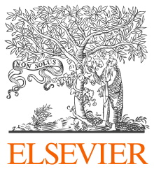

This is the homepage of the International Semantic Web Conference ([ISWC](https://iswc2019.semanticweb.org/)) **Reproducibility Initiative**.

### What is the ISWC Reproducibility Initiative?

The ISWC Reproducibility Initiative has the following goals:

- to enable easy sharing of code and experimentation set-ups (take a paper and reuse it)
- to make more code and data available (openness).
- to highlight the impact and increase the credibility of the Semantic Web research.
- to facilitate the dissemination of research results.

So, our goal is to build a culture where sharing **results**, **code**, and **scripts** is the norm rather than an exception.
The challenge is to do this efficiently, which means building technical expertise on how to better research via creating repeatable and shareable research.

[//]: # (The [ISWC Reproducibility committee](http://db-reproducibility.seas.harvard.edu/#Committee) is here to help you with this.)

**The reproducibility initiative at ISWC2019 is sponsored by the Elsevier AI Lab - Amsterdam, part of ICAI**

{:refdef: style="text-align: center;"}

{: refdef}

Further resources:

- [Call for Participation](cfp/)
- [Submission Guidelines](submission/)
- [Reproducibility Guidelines](../guide/)
- [Programme Committee](pc/)

---

###  Why should I be part of this? 

You will be making it easy for other researchers to compare with your work, to adopt and extend your research. This instantly means more recognition for your work and higher impact.

*The experimental results of the paper were replicated by the committee and where found to support the central results reported in the paper*

*The experiments (data, code, scripts) are made available to the community*

Successful papers will be advertised at the conference.
In addition, the official ISWC Reproducibility website will maintains and advertises your papers, serving as a centralized location where researchers will be able to find all the experimentation material of shareable ISWC papers.
We will continue to enhance the functionality and material on this website to make it attractive and useful for the community.

---

### Submission system 
The authors should provide the system code and required data on a Github repository. 
Moreover, a README file describing the system and the installation process should be provided.
See the [submission guidelines](submission/) for details.

### Contact details

Email: [iswc2019-reproducibility@inria.fr](mailto:iswc2019-reproducibility@inria.fr) 
Website: [http://repro.semanticweb.org/](http://repro.semanticweb.org/) 
Twitter hashtag: [#iswc2019repro](https://twitter.com/search?q=%23iswc2019repro&src=typed_query&f=live) 

###  ISWC reproducibility precursor

The idea for this initiative came from a fulfilling experience getting the [SIGMOD reproducibility](http://db-reproducibility.seas.harvard.edu/) label. We are grateful to them for allowing us to reuse text from their website.
